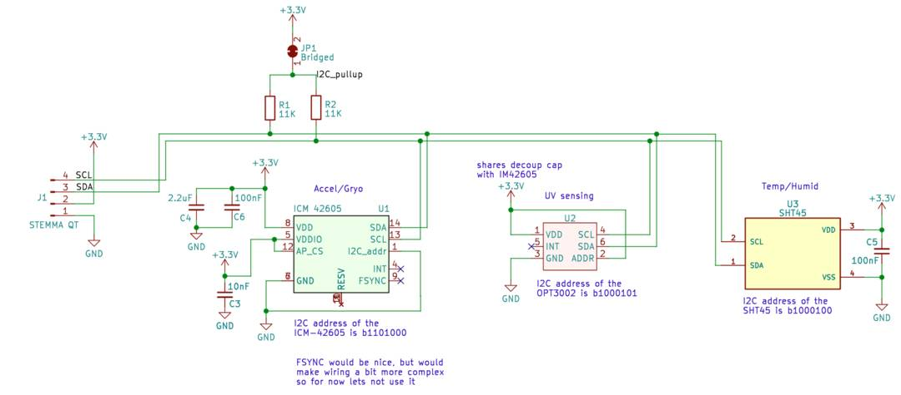

## Chuck Sensor PCB

This PCB is designed to fit into the sample chuck of the MEDJED system. It contains the following 3 sensors:

* A temperature and humidity sensor
* An accelerometer and gyroscope 
* A UV sensor

### UV sensor

The OPT3002 Light sensor will be useful to calibrate and correct for UV intensity of the illumination and projection system. The sensing area is smaller than the projected area, so some stage movement and averaging tricks will have to be applied. 

Some fiducial crosses and silkscreen markings have been added to help automation efforts and the finding of the IC when manually moving the stage around

### Temperature and Humidity sensor

The SHT45 temperature and humidity sensor is just for logging purposes. Changes in temperature and humidity can affect the photoresist and development process, so having a record of this is useful.

### Accelerometer and Gyroscope

The ICM42605 accelerometer and gyroscope unit can serve two purposes:

1. Get a feel for stage movement and apply input shaping to increase movement and settling speed (low priority)
2. Determine when the stage has settled and we are ready to expose an image. 

